# 👀 TrendLens – 네이버 검색 트렌드 자동 분석 시스템  
AI 기반 검색 트렌드 수집 · 분석 · 예측 · PDF 리포트 생성까지 지원하는 올인원 데이터 분석 플랫폼

TrendLens는 네이버 데이터랩 API를 활용하여 키워드 검색량을 수집하고, 트렌드 분석 · 상관 관계 분석 · 급등 이벤트 원인 분석 · 시계열 예측 등을 수행하는 **올인원 분석 대시보드**입니다.

Streamlit 기반 웹 UI를 통해 손쉽게 데이터를 탐색할 수 있으며,  
Prophet / ARIMA / RandomForest 기반의 예측 모델을 사용해 미래 검색량을 예측할 수 있습니다.

### 🔗 Live Demo  
**https://trendlens-analysis.streamlit.app/**

---

# 📚 목차 (Table of Contents)

* [👀 TrendLens – 네이버 검색 트렌드 자동 분석 시스템](#-trendlens--네이버-검색-트렌드-자동-분석-시스템)
* [⚙ 설치 및 실행](#-설치-및-실행)
  * [1) 프로젝트 다운로드](#1-프로젝트-다운로드)
  * [2) 패키지 설치](#2-패키지-설치)
  * [3) Streamlit 실행](#3-streamlit-실행)
* [🔑 API 키 설정](#-api-키-설정-필수-3종)
* [🚀 전체 기능](#-전체-기능)
* [🧩 상세 기능 설명 + 데모](#-상세-기능-설명--데모)
  * [1) 네이버 검색 데이터 자동 수집](#-1-네이버-검색-데이터-자동-수집)
  * [2) CSV 저장 · 병합 · 자동 로드](#-2-csv-저장--병합--자동-로드)
  * [3) 트렌드 비교 (Tab 1)](#-3-트렌드-비교-tab-1)
  * [4) 급등(Surge) 이벤트 자동 감지 (Tab 2)](#-4-급등surge-이벤트-자동-감지-tab-2)
  * [5) 뉴스 수집 + AI 기반 급등 원인 분석](#-5-뉴스-수집--ai-기반-급등-원인-분석-tab-2)
  * [6) 상관 분석 (Tab 3)](#-6-상관-분석-tab-3)
  * [7) 검색 트렌드 예측 (Tab 4)](#-7-검색-트렌드-예측-tab-4)
  * [8) 모델 성능 비교 (Tab 5)](#-8-모델-성능-비교-tab-5)
  * [9) PDF 자동 리포트 생성 (Tab 6)](#-9-pdf-자동-리포트-생성-tab-6)
  * [10) 계정 관리 기능](#-10-계정-관리-기능)
  * [11) 자동 데이터 수집 스케줄러](#-11-자동-데이터-수집-스케줄러)
* [⚠ AI 기능의 한계](#-ai-기능의-한계)
* [🛠 기술 스택](#-기술-스택)
* [📄 라이선스](#-라이선스)

---

# ⚙ 설치 및 실행

## 1) 프로젝트 다운로드
```bash
git clone https://github.com/yuji4/TrendLens.git
cd TrendLens
```

## 2) 패키지 설치

```bash
pip install -r requirements.txt
```

## 3) Streamlit 실행

```bash
streamlit run streamlit_app.py
```

---

# 🔑 API 키 설정 (필수 3종)

TrendLens 기능을 100% 사용하려면 다음 **3개의 API 키가 모두 필요합니다.**

`.env` 파일을 프로젝트 최상위 루트에 생성하고 아래처럼 입력하세요:

```
OPENAI_API_KEY=여기에_OpenAI_API_키
NAVER_CLIENT_ID=여기에_네이버_검색_API_클라이언트_ID
NAVER_CLIENT_SECRET=여기에_네이버_검색_API_클라이언트_SECRET
NAVER_NEWS_CLIENT_ID=여기에_네이버_뉴스_API_클라이언트_ID
NAVER_NEWS_CLIENT_SECRET=여기에_네이버_뉴스_API_클라이언트_SECRET
```

## ✔ 발급 경로

* OpenAI API: [https://platform.openai.com/](https://platform.openai.com/)
* 네이버 검색/뉴스 API: [https://developers.naver.com/apps](https://developers.naver.com/apps)

---

# 🚀 전체 기능

| 기능           | 설명                         |
| ------------ | -------------------------- |
| 🔐 사용자 인증    | 로그인·회원가입·회원탈퇴              |
| 📊 검색 트렌드 분석 | 키워드별 시간대별 검색량 시각화          |
| ⚡ 급등 이벤트 감지  | 검색량 급증 자동 탐지               |
| 📰 뉴스 수집     | 관련 최근 뉴스 100개 스크래핑         |
| 🤖 AI 분석     | 키워드 관련 최신 동향 요약            |
| 🔗 상관 분석     | 키워드 간 패턴 유사도 분석            |
| 🔮 트렌드 예측    | Prophet / ARIMA / RF 예측 모델 |
| 📈 모델 성능 비교  | RMSE/MAPE 기반 최적 모델 선정      |
| 🧾 PDF 보고서   | 전체 분석 자동 문서화               |
| ⏰ 자동 수집      | 매일 자동 데이터 업데이트             |

---

# 🧩 상세 기능 설명 + 데모

## 🔍 1) 네이버 검색 데이터 자동 수집

네이버 DataLab API를 이용해 사용자 입력 조건에 맞춘 검색 트렌드를 자동으로 불러옵니다.
기본 설정 후 업데이트 버튼을 누르면 됩니다.

**지원 기능**

* 키워드 여러 개 동시 조회(최대 5개)
* 기간 설정(시작일~종료일)
* 단위 선택(date / week / month)
* API 응답 → DataFrame 변환
* 사용자별 디렉토리에 CSV 자동 저장
* 최신 CSV 자동 로딩

<p align="center"> 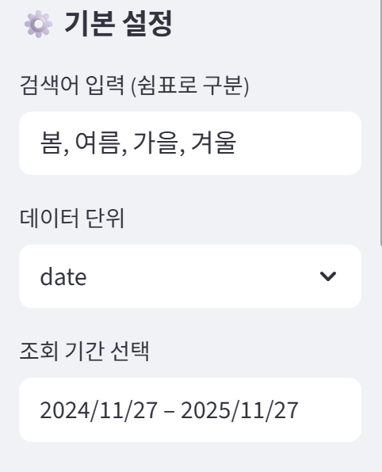 <br> <em>데이터 수집 UI 화면</em> </p>

---

## 📁 2) CSV 저장 · 병합 · 자동 로드

**CSV 저장**

* `trend_YYYYMMDD_HHMMSS.csv` 형태로 저장
* 사용자별 디렉토리(`data/{username}/`) 기반 분리 보관

**CSV 병합**

* 여러 CSV를 날짜 기준으로 병합하여 하나의 통합 파일 생성
* 날짜 기준 정렬 자동 수행
* 누락 날짜 옵션 제공

  * “전체 날짜”
  * “공통 날짜만"

**CSV 자동 로딩**

* 가장 최근 저장 파일 자동 선택
* 업데이트 이후 즉시 사용 가능

<p align="center"> 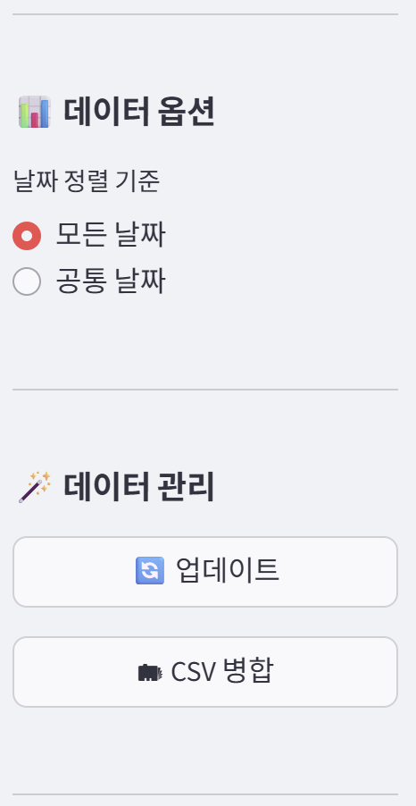 <br> <em>CSV 병합 UI 화면</em> </p>

---

## 📊 3) 트렌드 비교 (Tab 1)

Plotly 기반 시각적 분석 도구를 통해 검색량 변화 패턴을 직관적으로 확인할 수 있습니다.

**주요 기능**

* 키워드별 검색량 라인 차트
* Hover tooltip로 값/날짜 상세 확인
* 이동평균(Smoothing) 슬라이더 제공
* 전체 dataset 테이블 표시
* Marker / Grid 적용으로 가독성 강화

<p align="center"> 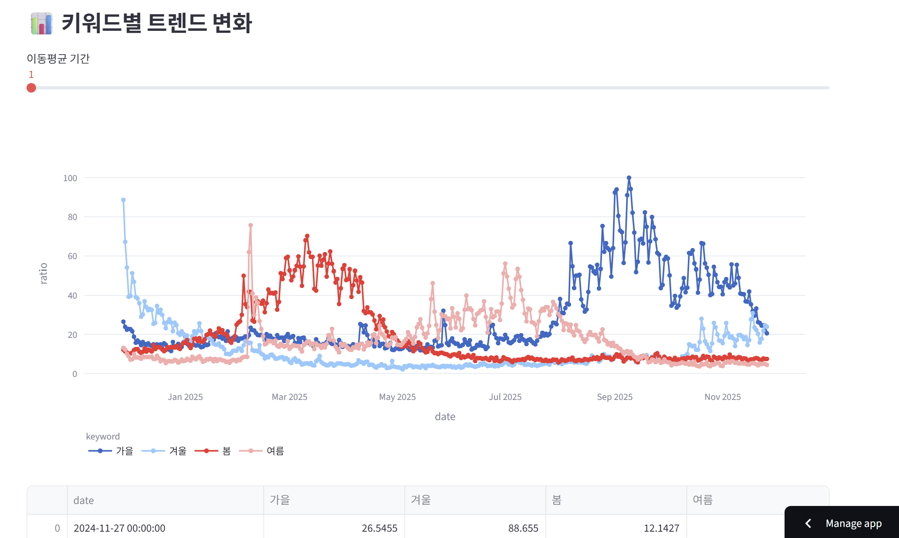 <br> <em>키워드별 트렌드 비교 그래프</em> </p>

---

## ⚡ 4) 급등(Surge) 이벤트 자동 감지 (Tab 2)

검색량이 급격히 증가한 구간을 자동 탐지합니다.

**기능 구성**

* 전일 대비 증가율 계산
* 증가율 ≥ 특정 threshold(기본 50%) → 급등 이벤트로 분류
* 각 키워드별 “최대 급등 발생일자” 자동 선택
* 감지된 이벤트를 표 형태로 표시

<p align="center">  <br> <em>급등 이벤트 감지 테이블</em> </p>

---

## 📰 5) 뉴스 수집 + 🤖 AI 기반 급등 원인 분석 (Tab 2)

급등한 키워드에 대해 최신 뉴스를 기반으로 AI가 원인을 분석합니다.

### 동작 흐름

① 선택한 키워드로 네이버 뉴스 검색
② 상위 100개 뉴스(제목 / 요약 / 링크) 자동 수집
③ 최신 뉴스 데이터들을 GPT가 요약 분석
④ “급등 원인 분석 결과”로 출력

> ※ 네이버 뉴스 API 특성상 **과거 뉴스 수집 불가** →
> 따라서 “급등 원인 추정”이 아닌 “해당 키워드의 최신 동향 요약”을 제공합니다.

<p align="center"> 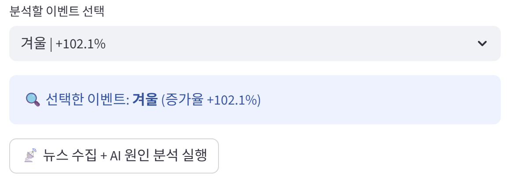 <br> <em>급등 분석 키워드 선택 화면</em> </p> <br> <p align="center"> 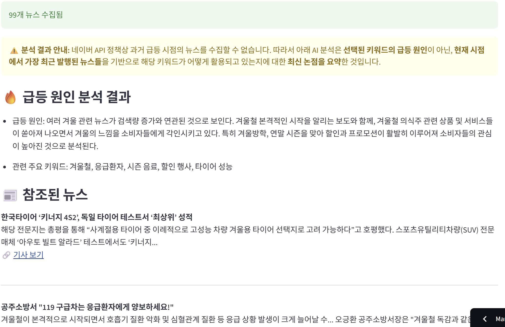 <br> <em>AI 분석 결과 및 뉴스 리스트</em> </p>

---

## 🔗 6) 상관 분석 (Tab 3)

키워드 간 검색량 패턴의 유사도를 분석합니다.

**제공 기능**

* Pearson 상관계수 계산
* 상관 행렬 Heatmap 시각화
* 키워드 간 유사도 Network Graph 제공

<p align="center"> 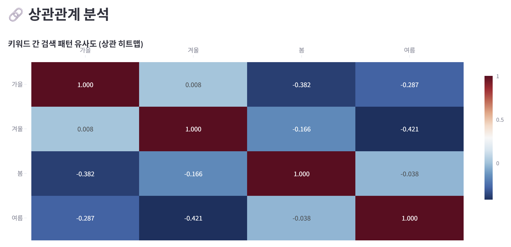 <br> <em>키워드 상관관계 Heatmap</em> </p> <br> <p align="center"> 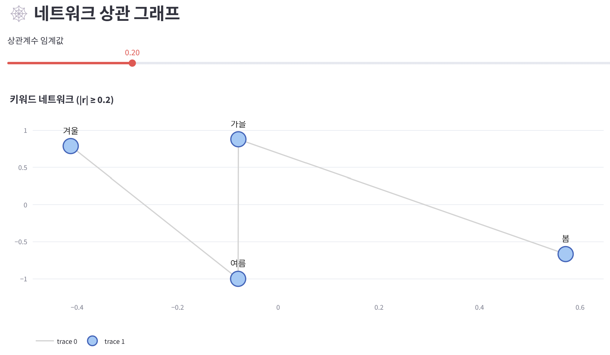 <br> <em>키워드 네트워크 그래프</em> </p> <br> <p align="center"> 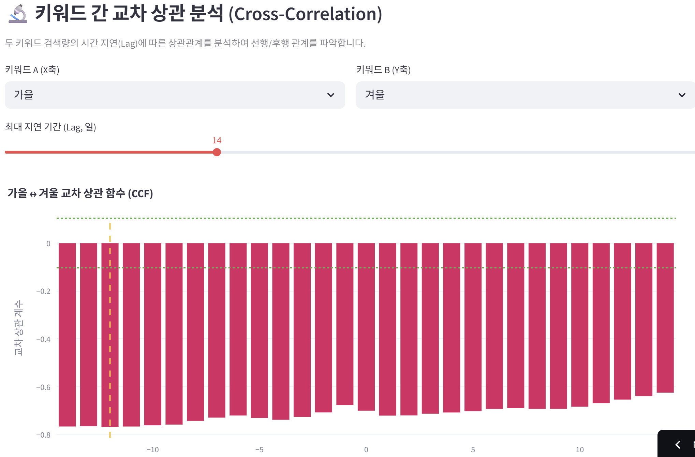 <br> <em>교차 상관(CCF) 분석</em> </p>
---

## 🔮 7) 검색 트렌드 예측 (Tab 4)

3가지 예측 모델을 통해 미래 검색량을 예측합니다.

### 지원 모델

* **Prophet (Meta)** – 계절성·추세를 자동 반영하는 시계열 특화 모델
* **ARIMA** – 단기 예측에 강한 고전 통계 기반 모델
* **RandomForestRegressor** – 날짜 기반 피처(dayofweek, month 등)를 활용한 머신러닝 모델 (**Optuna 하이퍼파라미터 튜닝 지원**)

### UI 기능

* 예측할 키워드 선택
* 예측 기간 설정(7일 ~ 180일)
* 각 모델별 시계열 예측 그래프
* 예측값 테이블 출력
* 모델 상세 설명 Tooltip 제공

<p align="center"> 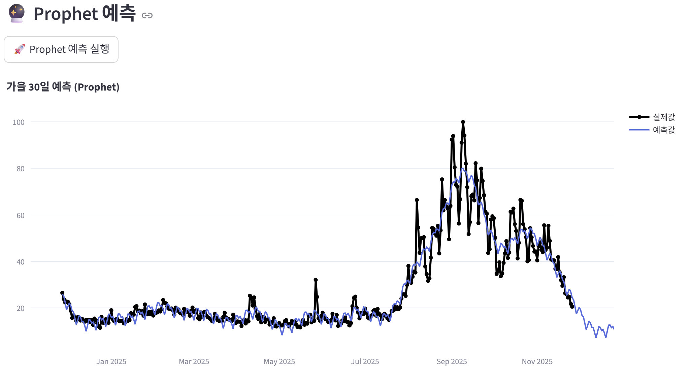 <br> <em>Prophet 예측 차트</em> </p> <br> <p align="center"> 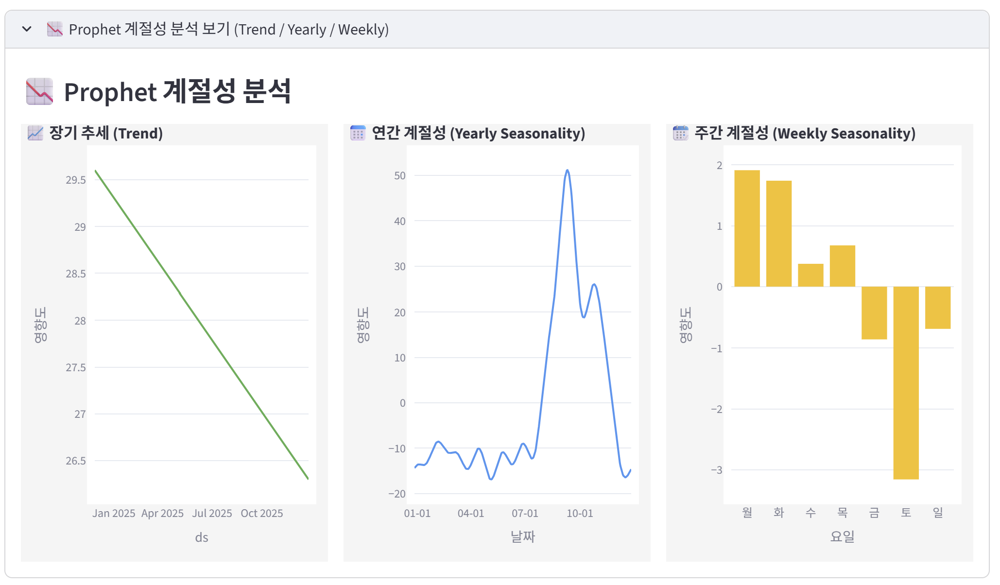 <br> <em>Prophet 계절성 분석</em> </p> <br> <p align="center"> 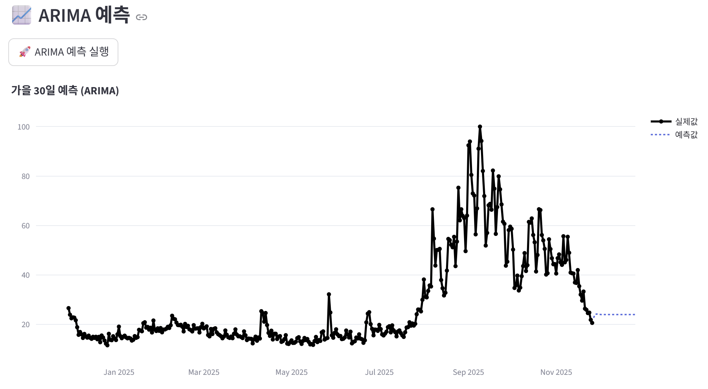 <br> <em>ARIMA 예측 차트</em> </p> <br> <p align="center"> 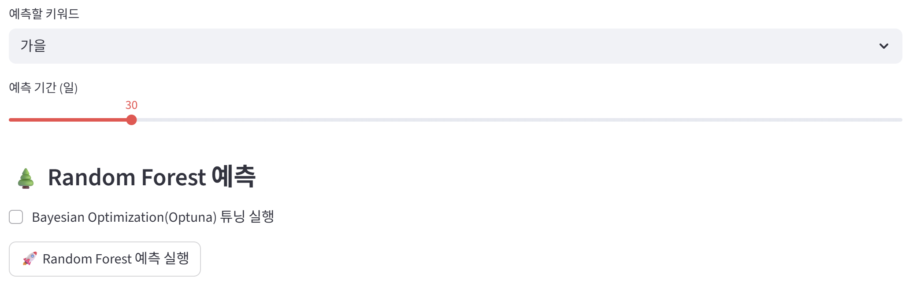 <br> <em>Random Forest 예측 UI</em> </p> <br> <p align="center"> 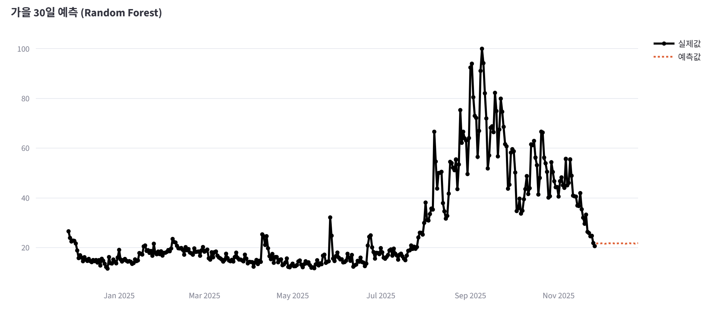 <br> <em>Random Forest 예측 차트</em> </p> <br> <p align="center"> 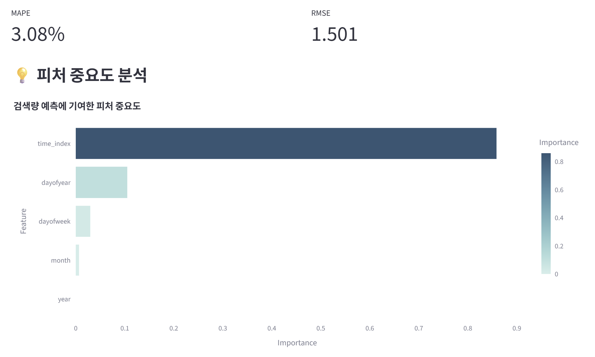 <br> <em>Random Forest 피처 중요도 분석</em> </p>

---

## 📈 8) 모델 성능 비교 (Tab 5)

예측 결과를 저장하고, 모델별 성능을 비교 분석합니다.

### 저장 구조

* 각 예측 실행 시 session_state에 성능 기록 추가
* 이후 비교 탭에서 누적된 모델 결과들을 한 번에 확인 가능

### 성능 지표

* RMSE (오차 크기)
* MAPE (오차 비율)

### 시각화

* 막대 그래프 기반 비교 차트
* 키워드별 최적 모델 자동 식별

<p align="center"> 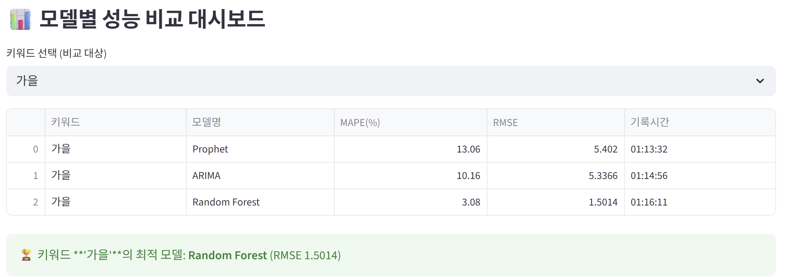 <br> <em>모델별 성능 비교 대시보드</em> </p> <br> <p align="center"> 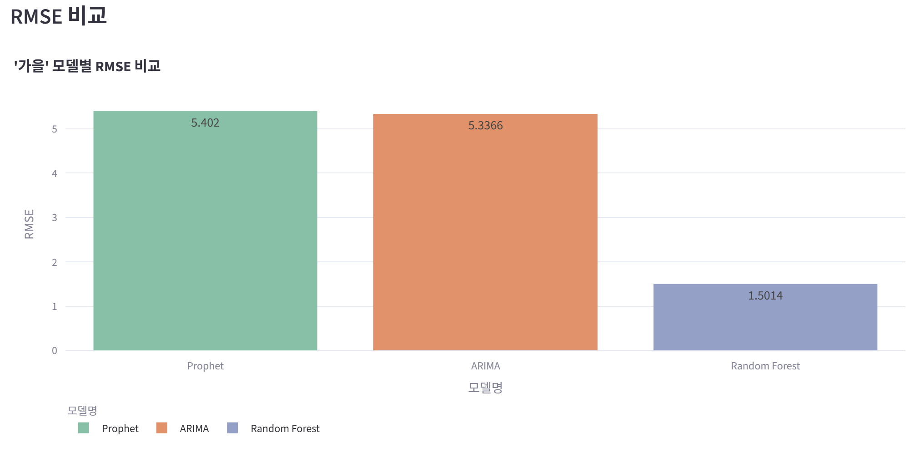 <br> <em>RMSE 비교 차트</em> </p>

---

# 🧾 9) PDF 자동 리포트 생성 (Tab 6)

TrendLens는 분석된 검색 트렌드를 PDF 문서로 자동 생성하여 다운로드할 수 있습니다.

### 📄 PDF 포함 항목

* **분석 개요**

  * 선택한 키워드
  * 조회 기간
  * 데이터 단위(date/week/month)

* **데이터 요약**

  * 최신 시점 검색량이 가장 높은 키워드 자동 분석

* **트렌드 시각화 이미지**

  * matplotlib 기반 라인 차트 자동 생성 및 삽입

* **예측 모델 성능 요약**

  * 전체 모델별 RMSE/MAPE 리스트
  * 키워드별 최적 모델(RMSE 최소) 자동 선정

* **푸터 정보 + 생성일시**

  * 문서 하단에 자동 삽입

### 🛠 기술 특징

* **A4 규격 PDF 생성**
* **한국어 폰트 `HYSMyeongJo-Medium` 완전 지원**
* **matplotlib 이미지 자동 렌더링 후 페이지 삽입**
* 페이지 여백이 부족할 시 자동 페이지 넘어감 (`showPage()`)
* 임시 이미지 파일 자동 삭제 처리

<p align="center"> 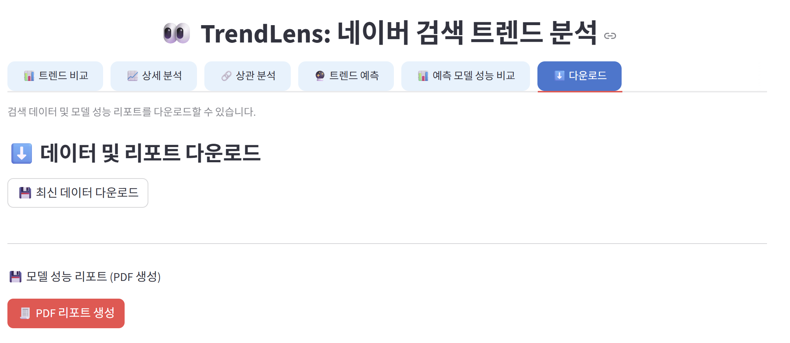 <br> <em>데이터 및 리포트 다운로드 화면</em> </p> <br> <p align="center"> 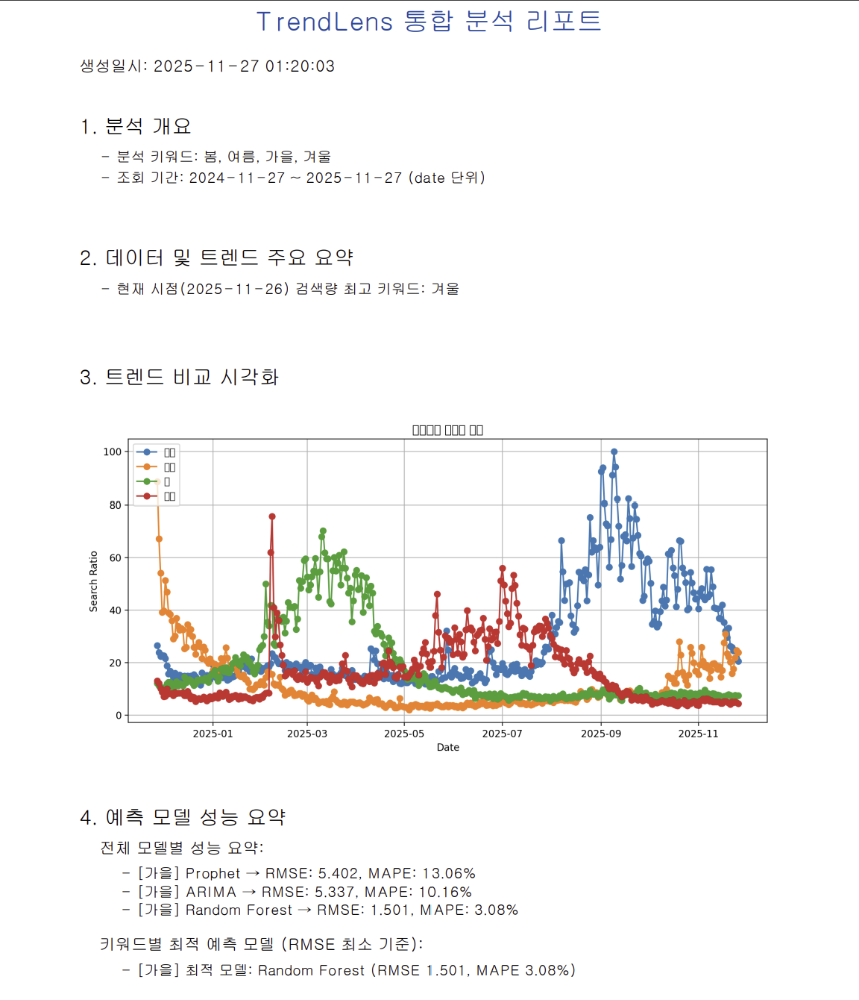 <br> <em>PDF 분석 리포트 예시</em> </p>

---

## 👤 10) 계정 관리 기능

전용 계정 페이지를 통해 사용자별 분석 데이터를 관리할 수 있습니다.

### 제공 기능

* 저장된 CSV 파일 리스트 확인
* 전체 CSV 파일 삭제
* 로그아웃
* 회원탈퇴(계정 + 데이터 폴더 완전 삭제)
* 메인 페이지 복귀 버튼

<p align="center"> 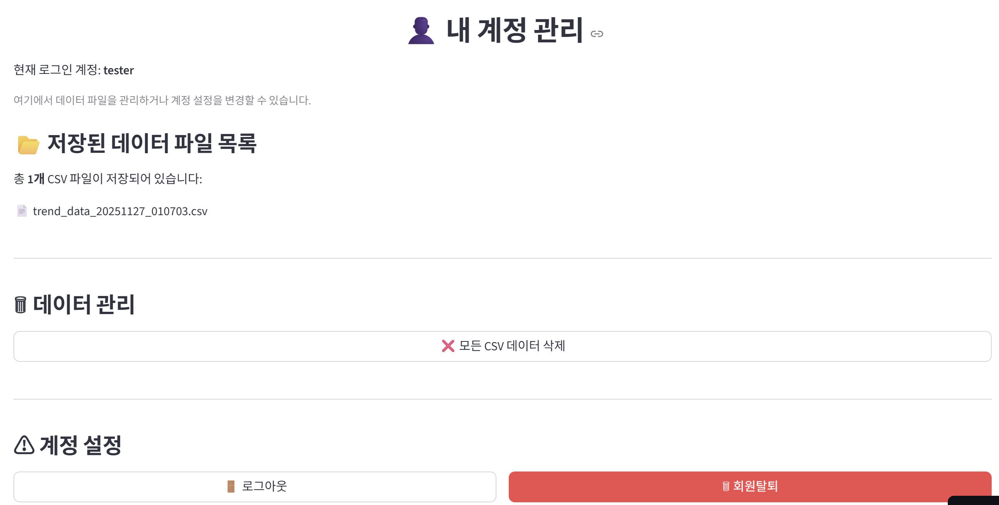 <br> <em>계정 관리 페이지 UI</em> </p>

---

## ⏰ 11) 자동 데이터 수집 스케줄러

APScheduler 기반 자동 크롤링 기능 제공합니다.

**지원 기능**

* 24시간 주기 자동 실행
* 자동 수집된 CSV 파일 자동 저장
* 사이드바에서 최근 수집 기록 확인 가능

<p align="center"> 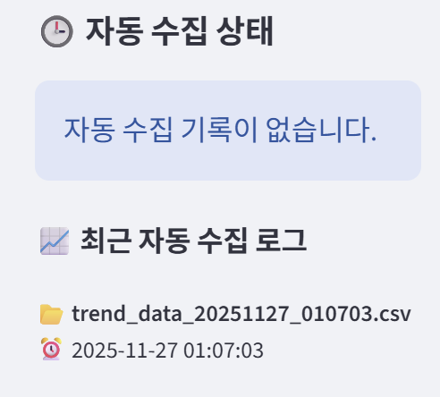 <br> <em>자동 데이터 수집 상태 UI</em> </p>

---

# ⚠ AI 기능의 한계

네이버 뉴스 API는 **과거 날짜의 뉴스를 제공하지 않는다.**
따라서:

* 급등 이벤트가 발생한 “당시의 원인”은 알 수 없고
* 대신 해당 키워드의 **최신 뉴스 동향**을 분석하게 된다

이는 README와 UI에 명확하게 안내하고 있다.

---

# 🛠 기술 스택

### **Backend / ML**

* Python
* Prophet / ARIMA
* sRandom Forest (scikit-learn)

### **Frontend**

* Streamlit
* Plotly

### **Data**

* Naver DataLab API
* Naver News Search API

### **Report**

* reportlab

---

# 📄 라이선스

**MIT License**


